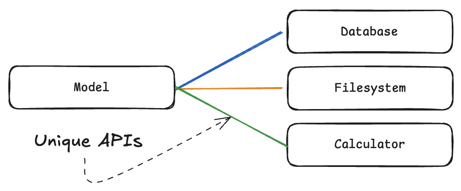
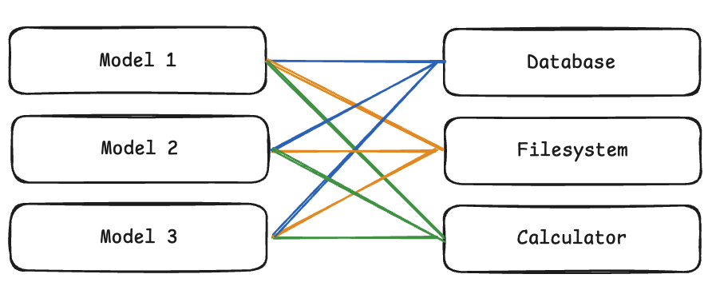
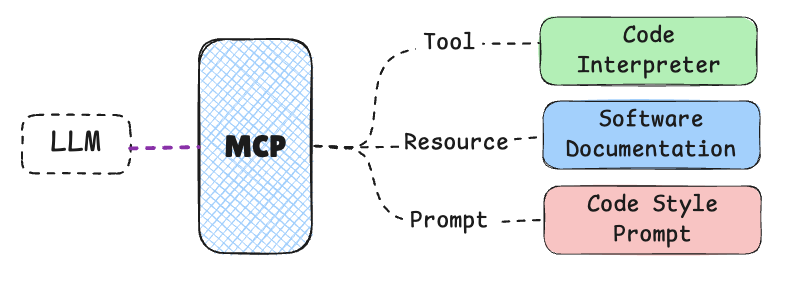
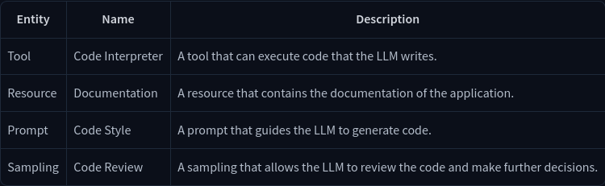
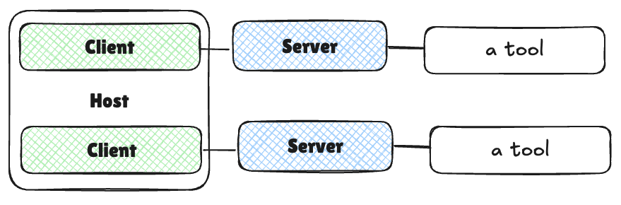

#  [Model Context Protocol (MCP)](https://huggingface.co/learn/mcp-course/unit1/introduction)

## Introduction to MCP

### Importance of MCP

Model Context Protocol (MCP) enables AI models to connect with external data sources, tools, and environments, allowing for the seamless transfer of information and capabilities between AI systems and the broader digital world. 

### Key Concepts and Terminology

MCP is often described as the “USB-C for AI applications.” Just as USB-C provides a standardized physical and logical interface for connecting various peripherals to computing devices, MCP offers a consistent protocol for linking AI models to external capabilities.

#### The Integration Problem

##### Without MCP (M x N Problem)

In this case developers need to create M x N custom integrations for pairing an AI application with an external capability.
<table>
    <tr>
        <td></td>
        <td></td>
    </tr>
    <tr>
        <td align="center">One Model</td>
        <td align="center">Multiple Models</td>
    </tr>
</table>

##### With MCP (M + N Problem)

<table>
    <tr>
        <td></td>
    </tr>
    <tr>
        <td align="center">Each AI application implements the client side of MCP once, and each tool/data source implements the server side once.</td>
    </tr>
</table>

#### Core MCP Terminology

MCP is a standard like HTTP or USB-C, and is a protocol for connecting AI applications to external tools and data sources.

##### Components

- **Host**: Hosts initiate connections to MCP Servers and orchestrate the overall flow between user requests, LLM processing, and external tools.
- **Client**: A component within the host application that manages communication with a specific MCP Server. Each Client maintains a 1:1 connection with a single Server, handling the protocol-level details of MCP communication and acting as an intermediary between the Host’s logic and the external Server.
- **Server**: An external program or service that exposes capabilities (Tools, Resources, Prompts) via the MCP protocol.

##### Capabilities

| Capability | Description | Example |
|------------|-------------|---------|
| **Tools** | Executable functions that the AI model can invoke to perform actions or retrieve computed data. Typically relating to the use case of the application. | A tool for a weather application might be a function that returns the weather in a specific location. |
| **Resources** | Read-only data sources that provide context without significant computation. | A researcher assistant might have a resource for scientific papers. |
| **Prompts** | Pre-defined templates or workflows that guide interactions between users, AI models, and the available capabilities. | A summarization prompt. |
| **Sampling** | Server-initiated requests for the Client/Host to perform LLM interactions, enabling recursive actions where the LLM can review generated content and make further decisions. | A writing application reviewing its own output and deciding to refine it further. |

###### MCP example
<table>
    <tr>
        <td></td>
        <td></td>
    </tr>
    <tr>
        <td align="center">Code Agent.</td>
        <td align="center">MCP entities used in the example.</td>
    </tr>
</table>

### Architectural Components of MCP

#### Host, Client, and Server

The Model Context Protocol (MCP) is built on a client-server architecture that enables structured communication between AI models and external systems.

##### Host

The **Host** is the user-facing AI application that end-users interact with directly, like AI Chat apps (OpenAI ChatGPT), Cursor, Custom AI Agents, etc.

Host’s responsibilities include:

- Managing user interactions and permissions
- Initiating connections to MCP Servers via MCP Clients
- Orchestrating the overall flow between user requests, LLM processing, and external tools
- Rendering results back to users in a coherent format

##### Client

The **Client** is a component within the Host application that manages communication with a specific MCP Server. Key characteristics include:

- Each Client maintains a 1:1 connection with a single Server
- Handles the protocol-level details of MCP communication
- Acts as the intermediary between the Host’s logic and the external Server

##### Server

The **Server** is an external programm or service that exposes capabilities to AI models via MCP protocol. Servers:

The Server is an external program or service that exposes capabilities to AI models via the MCP protocol. Servers:

- Provide access to specific external tools, data sources, or services
- Act as lightweight wrappers around existing functionality
- Can run locally (on the same machine as the Host) or remotely (over a network)
- Expose their capabilities in a standardized format that Clients can discover and use

#### Communication Flow

- User Interaction: The user interacts with the Host application, expressing an intent or query.

- Host Processing: The Host processes the user’s input, potentially using an LLM to understand the request and determine which external capabilities might be needed.

- Client Connection: The Host directs its Client component to connect to the appropriate Server(s).

- Capability Discovery: The Client queries the Server to discover what capabilities (Tools, Resources, Prompts) it offers.

- Capability Invocation: Based on the user’s needs or the LLM’s determination, the Host instructs the Client to invoke specific capabilities from the Server.

- Server Execution: The Server executes the requested functionality and returns results to the Client.

- Result Integration: The Client relays these results back to the Host, which incorporates them into the context for the LLM or presents them directly to the user.

A key advantage of this architecture is its modularity. A single Host can connect to multiple Servers simultaneously via different Clients. New Servers can be added to the ecosystem without requiring changes to existing Hosts. Capabilities can be easily composed across different Servers.

#### Quiz 1: MCP Fundamentals

- Q1: What is the primary purpose of Model Context Protocol (MCP)?
    - To enable AI models to connect with external data sources, tools, and environments
- Q2: What problem does MCP primarily aim to solve?
    - The M×N Integration Problem
- Q3: Which of the following is a key benefit of MCP?
    - Standardization and interoperability in the AI ecosystem
- Q4: In MCP terminology, what is a “Host”?
    - The user-facing AI application
- Q5: What does “M×N Integration Problem” refer to in the context of AI applications?
    -  The challenge of connecting M AI applications to N external tools without a standard